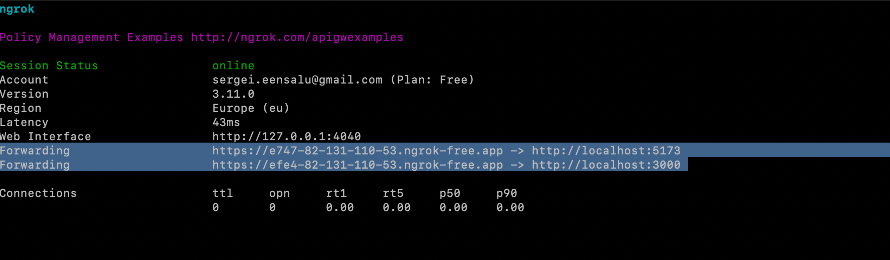
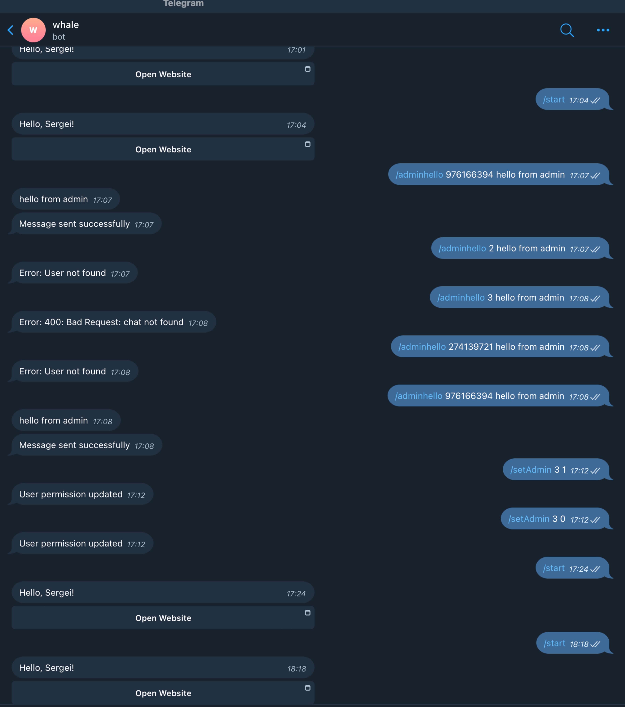
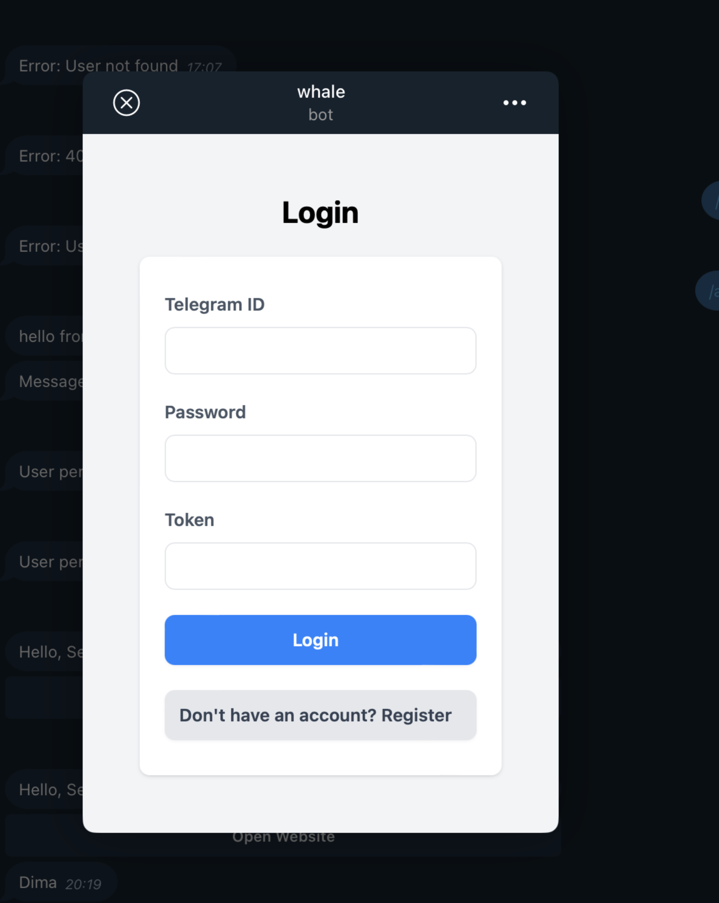
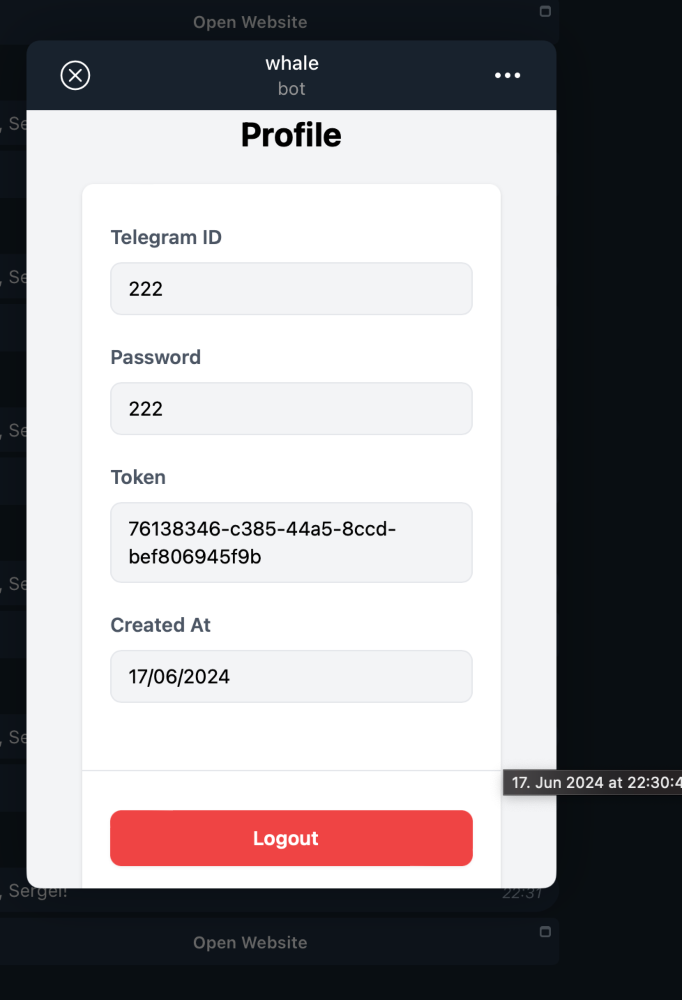

# Welcome to Whale, a server and web application designed to interact with Telegram users via a bot.

#### This README provides instructions on setting up and running both the server and web app components.

## Installation

Before you begin, ensure you have Node.js and npm installed on your machine.

### 1. Find ngrok.yml file under SERVER project. Example of ngrok.yml:
Server: https://github.com/SergeiEensalu/server
```bash
version: "2"
authtoken: YOUR_NGROK_AUTH_TOKEN
tunnels:
  web_app:
    addr: 5173
    proto: http
  server:
    addr: 3000
    proto: http
```

### 2. Download and Run ngrok.yml

download ngrok:
https://ngrok.com/download

In server project exist ngrok.yml - in you terminal go to server root project /server (ngrok.yml)

```bash
ngrok start --config ngrok.yml --all
```

If not, please follow this command:

```bash
ngrok start --config /path/to/your/ngrok.yml --all
```

Note down the forwarded URLs provided by ngrok, such as (this is an example):

```bash
LINK 1: https://b526-82-131-110-53.ngrok-free.app -> http://localhost:5173
LINK 2: https://dffb-82-131-110-53.ngrok-free.app -> http://localhost:3000
```



### 3.Configuration

After ngrok is running, update the following configurations in your project:

### Server Configuration

1. Take LINK 1 from paragraph nr 3 (previous part) and update the URL in SERVER: server/src/service/start.ts:
Server: https://github.com/SergeiEensalu/server

```bash
  const options = {
    reply_markup: {
      inline_keyboard: [
        [
          {
            text: 'Open Website',
            web_app: {
              url: `${YOUR_URL}/login` // TODO: REPLACE 'YOUR_URL' WITH YOU LINK 1. 
            }
          }
        ]
      ]
    }
  };
```

Code should like something like this (this is example)

```bash
  const options = {
    reply_markup: {
      inline_keyboard: [
        [
          {
            text: 'Open Website',
            web_app: {
              url: `https://b526-82-131-110-53.ngrok-free.app/login` // TODO: REPLACE 'YOUR_URL' WITH YOU LINK 1.
            }
          }
        ]
      ]
    }
  };
  
```

### WEB Configuration

1. Take LINK 2 from paragraph nr 3 (previous part) and update the URL in WEB: web/src/server/index.ts:
WEB: https://github.com/SergeiEensalu/web
```bash
export const BASE_URL = `${YOUR_URL}`; // TODO: REPLACE 'YOUR_URL' WITH YOU LINK 2.
```

Code should like something like this (this is example)

```bash
export const BASE_URL = 'https://dffb-82-131-110-53.ngrok-free.app'; // TODO: REPLACE 'YOUR_URL' WITH YOU LINK 2.
```

### 4. Telegram bot:

Located here:
https://t.me/whale_demo_project_2023_bot

### 5.Running the Server Locally
Server: https://github.com/SergeiEensalu/server

To start the server locally:

```bash
npm install
npm run build
npm run start
```

### 6.Running the WEB Locally
WEB: https://github.com/SergeiEensalu/web
To start the server locally:

```bash
npm install
npm run build
npm run dev
```

### Commands for Telegram App

# Main Commands

```bash
/start: Initialize the bot.
/adminhello telegramId message 

Example: /adminhello 976166394 hello from admin
```

Admin Commands

```bash
/setAdmin telegramId boolean: 

Example:
/setAdmin 976166394 1: Set user 976166394 as admin.
/setAdmin 976166394 0: Set user 976166394 as not admin.
```

Couple examples:


